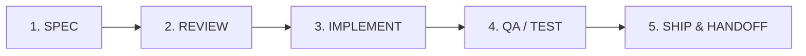

# Quy Tắc Cốt Lõi: Cổng Kiểm Soát Chất Lượng (Quality Gate Protocol)

> Đảm bảo tính kỷ luật trong kỹ thuật phần mềm: Không ship code bừa bãi, không triển khai mà thiếu kế hoạch và kiểm thử thực tế.

## 1. Vòng Đời Tác Nghiệp 5 Cổng (5-Gate Lifecycle)

1. **Gate 1 - Specification (`spec`)**: Biến ý định mơ hồ thành đặc tả kỹ thuật rõ ràng với tiêu chí nghiệm thu định lượng (Acceptance Criteria).
2. **Gate 2 - Plan Review (`plan-ceo-review` / `plan-eng-review`)**: Phản biện kế hoạch dưới góc nhìn kinh doanh, trải nghiệm người dùng và tính khả thi kỹ thuật trước khi gõ code. **Bắt buộc có Kế hoạch triển khai (Implementation Plan) được người dùng phê duyệt rõ ràng trước khi sang Gate 3.**
3. **Gate 3 - Implementation (`clean-code` & `full-output-enforcement`)**: Viết mã trọn vẹn, không viết tắt, tuân thủ nguyên tắc SOLID và API patterns.
4. **Gate 4 - Quality Assurance (`qa` & `test-audit`)**: Chạy kiểm thử động, rà soát lỗi API/CLI/UI thực tế, kiểm tra biên độ lỗi.
5. **Gate 5 - Ship & Handoff (`ship` & `handoff`)**: Tạo PR/Commit chuẩn mực, tài liệu hóa bàn giao `HANDOFF.md` để bất kỳ ai cũng có thể tiếp quản.

## 2. Tiêu Chuẩn Thực Nghiệm
- **Không bằng chứng = Không khẳng định**: Mọi khẳng định hoàn thành phải kèm kết quả lệnh terminal, file:line cụ thể hoặc log kiểm thử thực tế.
- **Không triển khai khi chưa được phê duyệt**: Chưa có Implementation Plan được người dùng đồng ý thì không sửa mã hay tạo/xóa file.
- **Không tự ý chuyển cổng**: Nếu Gate QA chưa pass, tuyệt đối không bước sang Gate Ship.
